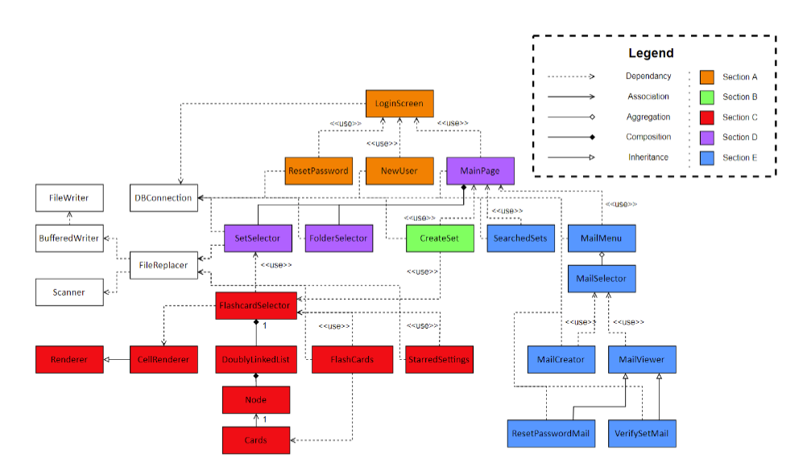
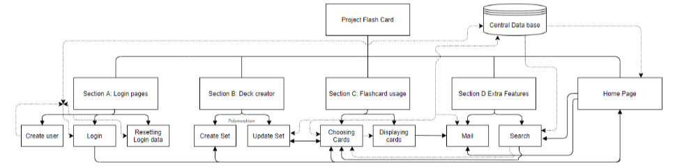

Flashcard System

How to run:
- The executable JAR file is called mandarin-learning-card-game.JAR inside the project folder
- Before running the database must be set up
- This can be achieved by opening the database in PHPMyAdmin 
- Import database.sql file to PHPMyAdmin
- Run mandarin-learning-card-game.JAR

Final Method

- Import product file into NetBeans and rebuild project (hotkey f11)

